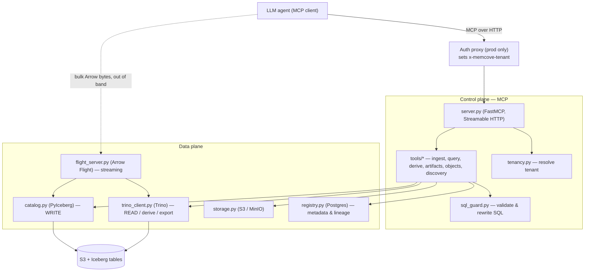

# Architecture

Memcove is a **control plane** (an MCP server agents talk to) over a **data plane**
(object store + query engine + catalog + registry + a streaming server). One invariant
runs through everything: **writes go through PyIceberg; reads, derivations, and exports
go through Trino** — and every operation is confined to the caller's tenant namespace.

## Components

### Control plane

- **`server.py`** — the FastMCP server (Streamable HTTP). Registers the 12 tools and 2
  resources, resolves the tenant from request headers (`_tenant(ctx)`), and delegates to
  the thin orchestration modules in `tools/`.
- **`tools/*`** — one module per verb: `ingest.py` (`ingest_object`, `request_upload`),
  `query.py` (`run_query`), `derive.py` (`derive_object`), `artifacts.py`
  (`export_artifact`), `objects.py` (`describe_object`, `get_object`, `list_objects`,
  `drop_object`), `discovery.py` (`discover_reference_data`).

### Core

- **`catalog.py` — PyIceberg write path.** The *only* place data is physically written.
  `write_arrow(namespace, label, table, mode)` creates/replaces/appends an Iceberg table
  from a PyArrow table. Also `ensure_namespace`, `table_exists`, `list_labels`,
  `drop_table`, `load_schema`.
- **`trino_client.py` — read / derive / export engine.** Wraps the Trino DBAPI:
  `execute`, `execute_arrow`, `execute_update` (DDL/CTAS), `scalar`, `ensure_schema`.
  `_principal(run_as)` implements optional per-tenant impersonation; `_connect` applies
  operator-configured session-property resource caps.
- **`storage.py` — object store.** boto3 S3/MinIO client. `read_parquet_table`,
  `write_parquet_table`, `write_bytes`, and the presigned-URL helpers `presign_put` /
  `presign_get`.
- **`registry.py` — Postgres metadata & lineage.** Source of truth for object *metadata*
  (`memcove_objects`) and lineage edges (`memcove_lineage`). The Iceberg catalog remains
  the source of truth for data and schema. Every query is tenant-scoped.
- **`sql_guard.py` — SQL safety.** `validate_select(...)` parses with sqlglot, enforces
  read-only single statements, and rewrites every table reference into the tenant
  namespace. See [Tenant isolation & the SQL guard](isolation.md).
- **`tenancy.py` — tenant resolution.** `normalize_tenant` maps a raw id to `t_<id>`;
  `resolve_tenant` picks the tenant from trusted headers (fail-closed provisioning map,
  or direct-header dev mode).
- **`tickets.py` — Flight ticket signing.** HMAC-signs and verifies the short-lived JSON
  commands used by the streaming plane.
- **`arrow_io.py`, `models.py`, `naming.py`** — inline-payload decoding, the Pydantic
  return types (`MemoryObject`, `PreviewResult`, `ArtifactRef`, `UploadTicket`, …), and
  label validation.

### Streaming data plane

- **`flight_server.py`** — the gRPC Arrow Flight server. `do_put` (ingest), `do_get` /
  `get_flight_info` (read/query). Lets clients move bulk Arrow batches out-of-band.

## The five flows

### 1. Ingest — `remember_dataset` → PyIceberg
Resolve the `source` into a PyArrow table (inline decode / allowlisted `s3://` read /
tenant-bound upload handle), then **write via `catalog.write_arrow`** and record metadata
in the registry. Not Trino.

### 2. Query — `query_memory` → guard → Trino
`sql_guard.validate_select` validates and rewrites the SQL, `wrap_preview` caps it, and
`trino_client.execute` runs it (as the tenant when impersonation is on). Returns a capped
`PreviewResult`.

### 3. Derive — `derive_dataset` → Trino CTAS
The validated SELECT is wrapped in `CREATE TABLE <catalog>.<tenant>.<new_label> AS ...`
and run via Trino. Lineage (referenced parent datasets) is recorded in the registry.

### 4. Export — `export_dataset` → S3 presigned URL
The validated SELECT (capped at `export_row_cap`) runs through `execute_arrow`; the Arrow
table is serialized (parquet/csv/json), written to the artifacts bucket, and returned as
a presigned download URL.

### 5. Streaming — Arrow Flight
The control plane mints a **signed, expiring ticket/descriptor**; the client streams
bytes against the Flight server. Reads run the same guard + Trino path; writes go through
`catalog.write_arrow`. Bulk bytes never touch the MCP channel. See
[Streaming](../tools/streaming.md).

## The two write surfaces

Worth internalizing: the entire write surface is exactly two code paths —
`catalog.write_arrow` (inline / s3 / upload ingest, and Flight `DoPut`) and the Trino
CTAS in `derive_object`. Both are fed only validated labels and guard-rewritten SQL.
Everything else is read-only. That is what makes the isolation model tractable.
